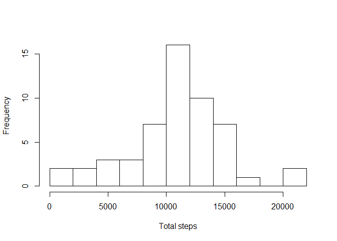
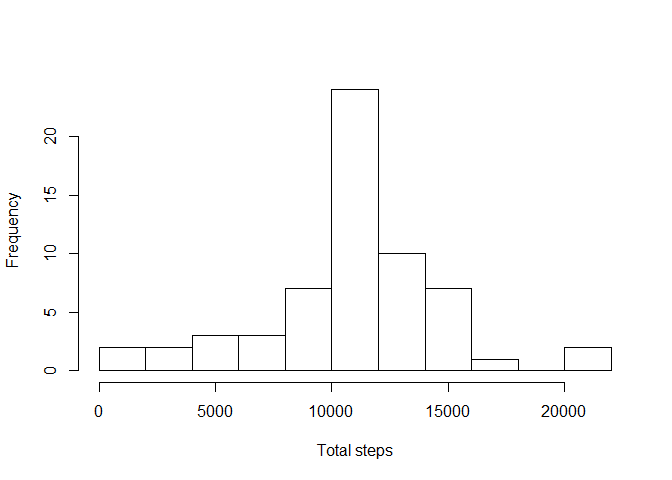
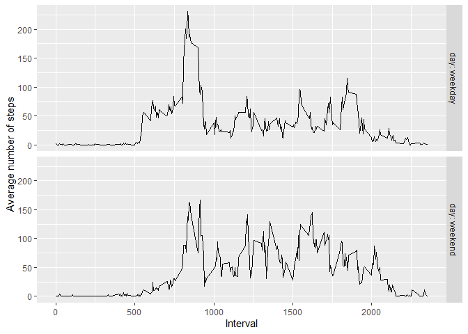

## Loading and preprocessing the data

At this step we load the data from an archive.

The variables included in this dataset are:

- *steps*: Number of steps taking in a 5-minute interval (missing values are coded as NA).

- *date*: The date on which the measurement was taken in YYYY-MM-DD format.

- *interval*: Identifier for the 5-minute interval in which measurement was taken.


```r
data<-read.csv(unz("activity.zip","activity.csv"))
```

## What is mean total number of steps taken per day?

At this step we are going to:

1. Make a histogram of the total number of steps taken each day

2. Calculate and report the mean and median total number of steps taken per day

P.S. The missing values was ignored. Hist plot maked by Freedman and Diaconis method.


```r
totalSteps <- aggregate(steps ~ date, data = data, sum, na.action = na.omit)
hist(totalSteps$steps, breaks = "FD", main="", xlab="Total steps")
```

<!-- -->

```r
summary(totalSteps$steps)
```

```
##    Min. 1st Qu.  Median    Mean 3rd Qu.    Max. 
##      41    8841   10765   10766   13294   21194
```

It looks pretty much like normal distribution, but we are not going to check that.

## What is the average daily activity pattern?

At this step we are going to:

1. Make a time series plot of the 5-minute interval (x-axis) and the average number of steps taken, averaged across all days (y-axis)


```r
avgSteps <- aggregate(steps ~ interval, data = data, mean, na.action = na.omit)
plot(avgSteps$interval, avgSteps$steps, type="l", main="", xlab="Interval", ylab="Average number of steps")
```

<!-- -->

2. Define the 5-minute interval which contains the maximum number of steps, on average across all the days in the dataset


```r
avgSteps[avgSteps$steps==max(avgSteps$steps),]
```

```
##     interval    steps
## 104      835 206.1698
```

## Imputing missing values

1. Calculation of the total number of missing values in the dataset (i.e. the total number of rows with NAs)


```r
NAsum<-sum(is.na(data$steps))
```
Total number of missing values is 2304.

2. Our strategy for the missing values is to replace each one by mean value of the same 5-minute interval.


```r
getMean <- function(x){
    avgSteps[avgSteps$interval==x,]$steps
}

#library(dplyr)
#rep_data <- data %>%
#   mutate(rep_mean  = ifelse(is.na(steps), getMean(interval), steps))  
#I dunno why it doesn't work correctly

#library(data.table)
#rep_data <- data.table(data)[is.na(steps), 
#         `:=`(rep_mean = getMean(interval))]
# it too :(

for(i in 1:nrow(data)) {
   row<-data[i,]
   data[i,"rep"]<-ifelse(is.na(row$steps), getMean(row$interval), row$steps)
}
# it tooks a lot of time  
```

3. Make a histogram of the total number of steps taken each day and Calculate and report the mean and median total number of steps taken per day.


```r
totalSteps <- aggregate(rep ~ date, data = data, sum, na.action = na.omit)
hist(totalSteps$rep, breaks = "FD", main="", xlab="Total steps")
```

<!-- -->

```r
summary(totalSteps$rep)
```

```
##    Min. 1st Qu.  Median    Mean 3rd Qu.    Max. 
##      41    9819   10766   10766   12811   21194
```

These values don't differ from the estimates from the first part of the our assignment.
So, our strategy of imputing missing data doesn't impact on the estimates of the total daily number of steps.

## Are there differences in activity patterns between weekdays and weekends?

1. Create a new factor variable (calld "day") in the dataset with two levels – “weekday”
and “weekend” indicating whether a given date is a weekday or weekend day.


```r
getWeekDay <- function(x){
    day<-as.POSIXlt(as.Date(x))$wday
    ifelse(day==0 | day==6, "weekend", "weekday")
}

library(dplyr)
```

```
## 
## Attaching package: 'dplyr'
```

```
## The following objects are masked from 'package:stats':
## 
##     filter, lag
```

```
## The following objects are masked from 'package:base':
## 
##     intersect, setdiff, setequal, union
```

```r
data <- data %>%
   mutate(day = getWeekDay(date))  
```

2. Make a panel plot containing a time series plot of the 5-minute interval (x-axis) and the average number of steps taken, averaged across all weekday days or weekend days (y-axis).


```r
avgSteps <- aggregate(rep ~ interval + day, data = data, mean, na.action = na.omit)

library(ggplot2)
p <- ggplot(avgSteps, aes(x=interval, y=rep, group=day)) + geom_line() + facet_grid(day ~ ., labeller=label_both) + labs(y = "Average number of steps", x = "Interval")

print(p)
```

<!-- -->


